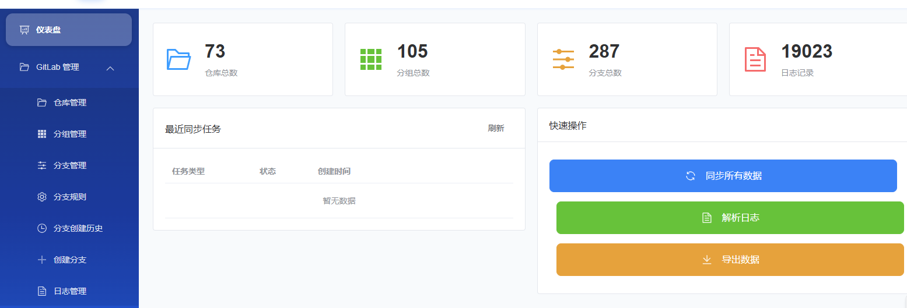
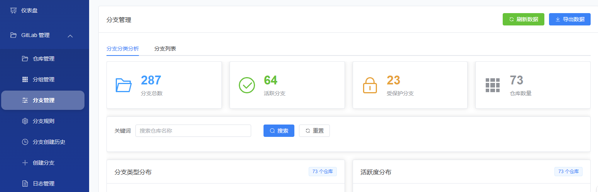
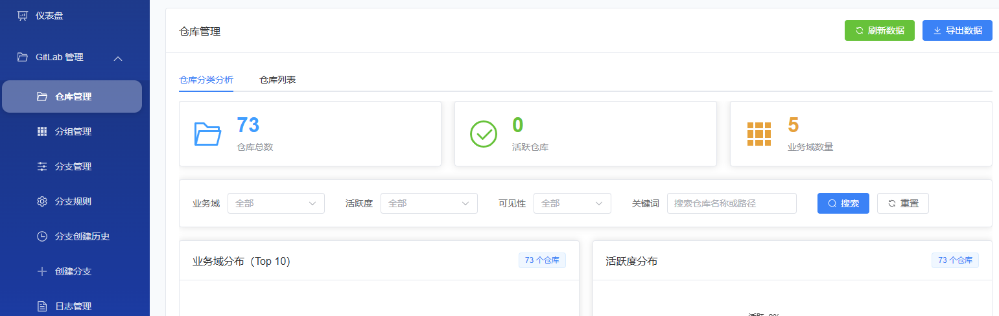
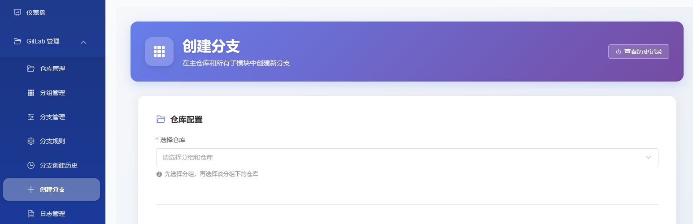

# GitLab Insight

<p align="center">
  <strong>🎵 一站式 GitLab 项目分析与管理平台 — A Vibe Coding Project</strong>
</p>

<p align="center">
  
  
</p>

<p align="center">
  
  
  
  
  
</p>

---

## 🎵 What is Vibe Coding?

> *"You just see things, say things, run things, and copy-paste things, and it mostly works."*
> — Andrej Karpathy

**本项目是一个 Vibe Coding 实践项目。** 整个开发过程由人类开发者与 AI（GitHub Copilot / Claude）协作完成——开发者负责描述需求、把控方向和验收结果，AI 负责代码生成、架构设计和重构优化。

- 🧠 **人类驱动方向**：定义功能需求、技术选型、产品决策
- 🤖 **AI 生成代码**：从后端 API 到前端页面，从数据库模型到部署配置
- 🔄 **对话式迭代**：通过自然语言对话持续迭代优化
- ✅ **人类验收质量**：运行、测试、审查、部署

---

## 📖 简介

GitLab Insights 是一个全栈 Web 应用程序，用于分析和管理 GitLab 项目数据。它提供了 GitLab API 访问监控、分支规则管理、批量标签创建、工作报告生成等一系列功能，帮助团队更高效地管理 GitLab 项目。

## 📸 界面预览

<table>
  <tr>
    <td align="center"><b>📊 仪表盘</b></td>
    <td align="center"><b>🌿 分支管理</b></td>
  </tr>
  <tr>
    <td></td>
    <td></td>
  </tr>
  <tr>
    <td align="center"><b>📦 仓库管理</b></td>
    <td align="center"><b>➕ 创建分支</b></td>
  </tr>
  <tr>
    <td></td>
    <td></td>
  </tr>
</table>

## 🧩 可扩展的微前端架构

本项目采用**可插拔的平台化设计**，通过 `shared/` 共享模块将认证和用户管理解耦为独立组件，使其可以被多个子应用复用：

```
                         ┌─────────────────────┐
                         │   GitLab Insights   │
                         │   主前端 (Vue 3)     │
                         │   ┌───┬───┬───┐     │
                         │   │Link│Link│Link│  │
                         │   └─┬─┴─┬─┴─┬─┘     │
                         └─────┼───┼───┼───────┘
                               │   │   │
              ┌────────────────┘   │   └────────────────┐
              ▼                    ▼                    ▼
     ┌────────────────┐  ┌────────────────┐   ┌────────────────┐
     │ GitLab Insight │  │  Jira 管理应用  │   │ Jenkins 管理应用│
     │   后端 (Flask) │  │  后端 (Flask)   │   │  后端 (Flask)  │
     └───────┬────────┘  └───────┬────────┘   └───────┬────────┘
             │                   │                     │
             └───────────────────┼─────────────────────┘
                                 ▼
                    ┌─────────────────────────┐
                    │    shared/ 共享模块       │
                    │  ┌─────────────────────┐│
                    │  │ auth_middleware.py   ││  JWT Token 生成/验证
                    │  │ (认证中间件)          ││  通用认证装饰器
                    │  ├─────────────────────┤│
                    │  │ user_model.py        ││  用户查询/创建/权限
                    │  │ (用户服务)            ││  跨应用数据共享
                    │  └─────────────────────┘│
                    └────────────┬─────────────┘
                                 ▼
                    ┌─────────────────────────┐
                    │  PostgreSQL (共享数据库)   │
                    │  User / 权限等公共表       │
                    └─────────────────────────┘
```

**扩展新应用只需 3 步：**

1. **后端**：新建独立 Flask 应用，导入 `shared/` 模块即可获得认证和用户管理能力
2. **前端**：新建独立前端项目，独立开发页面和功能
3. **集成**：在 GitLab Insights 主前端的导航栏添加跳转链接，统一入口

各子应用共享同一套用户体系和登录态（JWT），无需重复开发认证逻辑。

## ✨ 核心功能

| 功能模块 | 说明 |
|---------|------|
| **🔐 统一认证** | LDAP 集成登录 + JWT Token 管理（Access Token / Refresh Token） |
| **🔄 数据同步** | 自动同步 GitLab 项目和分支数据到本地数据库，支持全量/增量同步 |
| **🏷️ 批量标签创建** | 批量创建 GitLab 标签，支持子模块标签创建和任务队列管理 |
| **🌿 分支规则管理** | 定义/管理分支保护规则，自动清理不符合规则的分支，并记录清理历史 |
| **📊 监控与统计** | API 访问日志分析、系统性能监控、统计报表与可视化（ECharts） |
| **📝 工作报告** | 生成团队工作报告并导出 Excel |
| **📋 任务管理** | GitLab TODO 集成、任务列表管理 |
| **🏠 首页管理** | 可配置的首页快捷链接管理 |
| **⏰ 定时调度** | 基于 APScheduler 的自动化定时任务调度 |

## 🛠️ 技术栈

### 后端

- **Web 框架：** Flask 3.1
- **ORM：** SQLAlchemy 2.0
- **数据库：** PostgreSQL（psycopg2 驱动）
- **认证：** LDAP3 + PyJWT
- **GitLab API：** python-gitlab
- **任务调度：** APScheduler
- **数据导出：** openpyxl（Excel）
- **数据校验：** Pydantic
- **测试：** pytest + pytest-cov

### 前端

- **框架：** Vue 3（Composition API）
- **构建工具：** Vite 5
- **UI 组件库：** Element Plus
- **状态管理：** Pinia
- **路由：** Vue Router 4
- **HTTP 客户端：** Axios
- **数据可视化：** ECharts / vue-echarts
- **样式：** Sass

### 部署

- **容器化：** Docker（多阶段构建）

## 📁 项目结构

```
gitlab_insights/
├── src/                        # 后端源码
│   ├── main.py                 # Flask 应用入口
│   ├── api/                    # API 路由层
│   │   ├── auth_routes.py      # 认证路由（登录/登出）
│   │   ├── gitlab_routes.py    # GitLab 数据同步路由
│   │   ├── tag_routes.py       # 标签创建管理
│   │   ├── task_routes.py      # 任务管理路由
│   │   ├── branch_rule_routes.py # 分支规则管理
│   │   ├── home_link_routes.py # 首页链接管理
│   │   ├── log_routes.py       # 日志查询路由
│   │   ├── monitoring_routes.py # 监控统计路由
│   │   ├── auth_decorators.py  # 认证装饰器
│   │   └── response.py        # 统一响应格式
│   ├── services/               # 业务逻辑层
│   │   ├── gitlab_service.py   # GitLab API 交互
│   │   ├── auth_service.py     # 认证服务
│   │   ├── ldap_service.py     # LDAP 服务
│   │   ├── database_service.py # 数据库操作
│   │   ├── branch_rule_service.py # 分支规则服务
│   │   ├── task_service.py     # 任务服务
│   │   ├── export_service.py   # 数据导出（Excel）
│   │   ├── log_parser.py       # 日志解析
│   │   ├── monitoring_service.py # 监控服务
│   │   ├── scheduler.py        # 定时任务调度
│   │   └── ...
│   ├── database/               # 数据库层
│   │   ├── connection.py       # 数据库连接管理
│   │   └── models.py           # SQLAlchemy ORM 模型
│   ├── dto/                    # 数据传输对象（Pydantic）
│   ├── config/                 # 配置管理
│   │   ├── settings.py         # 应用配置（环境变量）
│   │   ├── logging_config.py   # 日志配置
│   │   └── ldap_config.py      # LDAP 配置
│   ├── middleware/             # 中间件
│   │   └── logging_middleware.py # HTTP 请求日志
│   ├── shared/                 # 共享模块
│   └── utils/                  # 工具函数
├── frontend/                   # 前端源码
│   ├── src/
│   │   ├── main.js             # Vue 应用入口
│   │   ├── App.vue             # 根组件
│   │   ├── views/              # 页面组件
│   │   │   ├── Dashboard.vue   # 仪表盘
│   │   │   ├── Home.vue        # 首页
│   │   │   ├── gitlab/         # GitLab 相关页面
│   │   │   ├── tasks/          # 任务管理页面
│   │   │   └── logs/           # 日志查看页面
│   │   ├── components/         # 可复用组件
│   │   ├── api/                # API 请求封装
│   │   ├── router/             # 路由配置
│   │   ├── stores/             # Pinia 状态管理
│   │   ├── layouts/            # 布局组件
│   │   ├── styles/             # 全局样式
│   │   └── utils/              # 前端工具函数
│   ├── index.html              # HTML 入口
│   ├── vite.config.js          # Vite 配置
│   └── package.json            # 前端依赖
├── tests/                      # 测试文件
├── docs/                       # 项目文档
├── logs/                       # 运行日志
├── Dockerfile                  # Docker 构建文件
├── requirements.txt            # Python 依赖
└── claude.md                   # AI 辅助开发指南
```

## 🚀 快速开始

### 环境要求

- Python 3.13+
- Node.js 18+
- PostgreSQL 14+

### 1. 克隆仓库

```bash
git clone https://github.com/azvvv/gitlab_insights.git
cd gitlab_insights
```

### 2. 配置环境变量

在项目根目录创建 `.env` 文件：

```bash
# 数据库配置
DB_HOST=localhost
DB_PORT=5432
DB_NAME=gitlab_insight
DB_USER=postgres
DB_PASSWORD=your_password

# GitLab 配置
GITLAB_URL=https://gitlab.example.com
GITLAB_TOKEN=your_gitlab_token

# LDAP 配置
LDAP_SERVER=ldap://ldap.example.com
LDAP_BASE_DN=dc=example,dc=com
LDAP_BIND_DN=cn=admin,dc=example,dc=com
LDAP_BIND_PASSWORD=admin_password

# JWT 配置
JWT_SECRET_KEY=your_secret_key
JWT_ACCESS_TOKEN_EXPIRES=3600
JWT_REFRESH_TOKEN_EXPIRES=86400

# 应用配置
FLASK_ENV=development
FLASK_DEBUG=True
HOST=0.0.0.0
PORT=5000
```

### 3. 启动后端

```bash
# 安装 Python 依赖
pip install -r requirements.txt

# 启动 Flask 服务
cd src
python main.py
```

后端服务将在 `http://localhost:5000` 启动。

### 4. 启动前端（开发模式）

```bash
cd frontend
npm install
npm run dev
```

前端开发服务器将在 `http://localhost:5173` 启动。

### 5. Docker 部署

```bash
# 构建镜像
docker build -t gitlab-insight:latest .

# 运行容器
docker run -d -p 5000:5000 --env-file .env gitlab-insight:latest
```

> Docker 采用多阶段构建：先构建前端静态资源，再打包到后端镜像中，一个容器同时提供前后端服务。

## 📡 API 概览

| 模块 | 路径 | 说明 |
|-----|------|------|
| 认证 | `POST /api/auth/login` | 用户登录 |
| 认证 | `POST /api/auth/logout` | 用户登出 |
| 认证 | `POST /api/auth/refresh` | 刷新 Token |
| GitLab | `POST /api/gitlab/sync` | 同步 GitLab 数据 |
| GitLab | `GET /api/gitlab/projects` | 获取项目列表 |
| GitLab | `GET /api/gitlab/branches` | 获取分支列表 |
| 标签 | `POST /api/tags/create` | 创建标签任务 |
| 标签 | `GET /api/tags/tasks` | 获取标签任务列表 |
| 分支规则 | `GET /api/branch-rules` | 获取所有规则 |
| 分支规则 | `POST /api/branch-rules` | 创建新规则 |
| 监控 | `GET /api/monitoring/stats` | 获取统计数据 |
| 监控 | `GET /api/monitoring/logs` | 查询日志 |

## 🧪 测试

```bash
# 运行所有测试
pytest

# 运行指定测试文件
pytest tests/test_database_service.py

# 生成覆盖率报告
pytest --cov=src --cov-report=html
```

## 📊 日志系统

应用使用分层日志系统，日志文件输出到 `logs/` 目录：

| 日志文件 | 说明 |
|---------|------|
| `app.log` | 应用主日志 |
| `error.log` | 错误日志 |
| `access.log` | HTTP 访问日志 |
| `gitlab.log` | GitLab API 调用日志 |
| `security.log` | 安全相关日志 |

## 🤝 开发规范

- **Python 代码风格：** PEP 8，缩进 4 空格
- **JS/Vue 代码风格：** ESLint 推荐规则，缩进 2 空格
- **命名规范：** Python `snake_case`，类名 `PascalCase`，Vue 组件 `PascalCase.vue`
- **提交信息：** `feat:` / `fix:` / `docs:` / `refactor:` / `test:` / `chore:`
- **分支管理：** `main`（生产）、`develop`（开发）、`feature/*`、`hotfix/*`

## 📄 License

MIT
